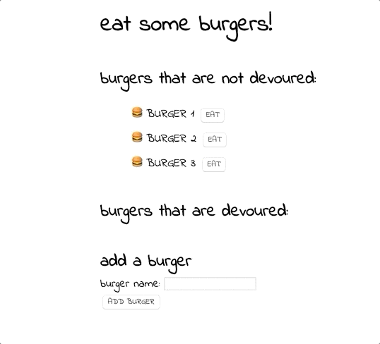

# 13-burger
## Unit 13 MVC Homework: Node Express Handlebars

A Node.js app using using the MVC design pattern. Powered by MySQL, Node, Express, Handlebars and an ORM.

## Live Application
Deployed at: [https://murmuring-escarpment-50784.herokuapp.com](https://murmuring-escarpment-50784.herokuapp.com)

## Run Locally  
clone the repo, cd to directory  
```bash 
npm install
```
```bash
npm start
``` 
go to [http://localhost:3000/](http://localhost:3000/)

